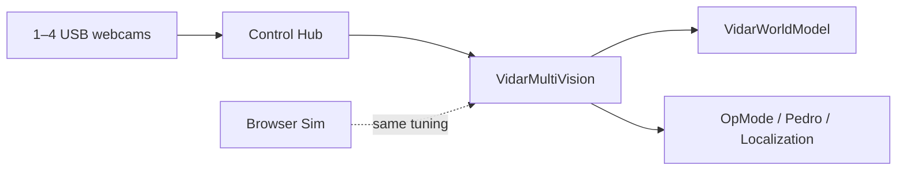

# ViDAR

Low-resolution, CPU-conscious vision for FTC — **game-element tracking**, **friend/foe plates**, and **sparse AprilTags** on the Control Hub.

## What it does

| Layer | Element / plate ROIs (configurable, overlapping) | Tag ROI (upper band) |
|-------|-----------------------------------------------------|----------------------|
| **Elements** | Color-blob + geometric filter + optional local Hough | — |
| **Plates** | Color mask → rotated rect → white-digit gate → width-based range | — |
| **Tags** | — | Scout every frame; official FTC decode ≤ 1 s |

Default element pipeline: **color segmentation** via `VidarContourProcessor` (unified element + plate pass), not full-frame Hough. Per-camera ROIs default to lower 65% (element), middle 40% (plate), upper 65% (tag) — not a fixed 50/50 split.

Supports **1–4 USB webcams** architecturally; sustained multi-camera USB stability requires **hardware validation** on your Control Hub. Scout tag observations **never alter absolute pose** — only decoded AprilTags pass localization gates.

**Localization** (odom + tag fusion for Pedro pathing) is a **separate system** that consumes ViDAR outputs — see [docs/ROADMAP.md](docs/ROADMAP.md).

## Quick links

| Path | Purpose |
|------|---------|
| [docs/API.md](docs/API.md) | Cross-language outer-layer API contract |
| [docs/SYSTEM_DESIGN.md](docs/SYSTEM_DESIGN.md) | Architecture and feature status |
| [docs/CONFIGURATION.md](docs/CONFIGURATION.md) | Tuning reference |
| [docs/CALIBRATION.md](docs/CALIBRATION.md) | Field calibration workflow |
| [docs/COORDINATE_FRAMES.md](docs/COORDINATE_FRAMES.md) | Frames, transforms, intrinsics, validation |
| [docs/TEACHING.md](docs/TEACHING.md) | Java lessons for Control Hub |
| [docs/ROADMAP.md](docs/ROADMAP.md) | Multi-cam wiring, validation, Pedro |
| [sim/](sim/) | Browser simulator with live overlays |
| `teamcode/.../vidar/` | OpModes to copy into FTC SDK |

## Browser simulator

Tune before hardware — mock scene or webcam, overlays for elements, plates, tags, and auto-seek.

```powershell
.\scripts\serve_sim.ps1
# or: python scripts/serve_sim.py
```

Open **http://127.0.0.1:8765** → **Start**.

Run offline tests:

```powershell
pip install -r requirements-dev.txt
python -m pytest tests/ -v
```

Tuning: `sim/vidar-tuning.json` ↔ `VidarConfig.java` / `VidarTagConfig.java`.

## Development

```powershell
pip install -r requirements-dev.txt
python -m pytest tests/ -v
```

See [CONTRIBUTING.md](CONTRIBUTING.md). License: MIT — see [LICENSE](LICENSE).

## Java on Control Hub

1. Clone [FTC SDK](https://github.com/FIRST-Tech-Challenge/FtcRobotController).
2. Copy `teamcode/org/firstinspires/ftc/teamcode/vidar/` → `TeamCode/src/main/java/.../vidar/`.
3. Configure USB webcams **`Webcam 1`** … **`Webcam 4`** (see `VidarConfig.CAMERA_NAMES`).
4. Set `VidarConfig.CAMERA_COUNT` (1–4). Alliance is set at runtime — see below.
5. Run OpModes: **Discover** → **TeleOp** → **Auto Seek**.

### Alliance (friend / foe)

No manual constant per match. Use `VidarAllianceSelector`:

| Method | When |
|--------|------|
| **Color sensor** on your own ROBOT SIGN (name `alliance_color` in config) | Auto at INIT |
| **Gamepad Y** = RED, **B** = BLUE | INIT override |
| **Back** button | Toggle during match (optional) |

```java
VidarAllianceSelector alliance = new VidarAllianceSelector(hardwareMap);
while (!isStarted() && !isStopRequested()) {
    alliance.pollInit(gamepad1);
    telemetry.addData("Alliance", alliance.formatStatus());
    telemetry.update();
}
VidarMultiVision vision = new VidarMultiVision(hardwareMap, odomSupplier, alliance::get);
```

Mount the REV Color Sensor V3 on the **colored background** of your sign (not the white digits). Tune `ALLIANCE_COLOR_*` in `VidarConfig` if readings are ambiguous.

### Multi-camera

```java
// VidarConfig.java
public static final int CAMERA_COUNT = 4;
public static final boolean ALLIANCE_USE_COLOR_SENSOR = true;
```

Each index uses `VidarCameraProfile.FOUR_SIDES[index]` (bearing 0°/90°/180°/270° + mount offsets). Calibrate floor LUT and `focalLengthPx` **per camera**.

```java
VidarMultiVision vision = new VidarMultiVision(hardwareMap, odomSupplier);
VidarWorldModel world = new VidarWorldModel();
vision.update();
world.update(vision, System.nanoTime());
```

### Package layout

```
vidar/
├── VidarConfig.java / VidarRuntimeConfig.java
├── config/                         ← season + robot JSON loaders
├── VidarCameraProfile.java / VidarCameraMount.java
├── VidarGeometry.java / VidarFrameRegions.java / VidarFramePipeline.java
├── VidarContourProcessor.java      ← unified element + plate detection
├── VidarContourDetect.java / VidarElementObservation.java
├── VidarPlateObservation.java / VidarAllianceSelector.java
├── VidarAdaptiveTagProcessor.java / VidarTagScoutRunner.java / VidarTagDecodeWorker.java
├── VidarFrameMailbox.java          ← zero-copy frame handoff to worker thread
├── VidarVision.java                ← one camera
├── VidarMultiVision.java           ← 1–4 cameras fused
├── VidarWorldModel.java            ← short-term spatial memory
├── VidarDiscoverOpMode.java
├── VidarTeleOp.java
└── VidarAutoSeekOpMode.java
```



## USB wiring (4 cameras)

Control Hub has limited USB ports — use a **powered USB 2.0 hub** (FTC docs historically recommend **Anker 4-port**) on **USB 3.0**, power hub from **REV +5V aux** or an **approved USB battery pack** (R617). Details: [docs/ROADMAP.md](docs/ROADMAP.md#phase-5--real-world-usb-wiring).

## Optional: Python / Docker

Off-robot experiments only (`docker compose up --build`). Competition path is Java + browser sim.

## Acknowledgements

ViDAR’s coordinate-frame and calibration foundation was substantially informed by Matt Vitelli’s [*How Robots Understand Space*](https://vivalosmentors.org/wp-content/uploads/2026/08/How_Robots_Understand_Space-Vitelli.pdf) ([Viva Los Mentors](https://vivalosmentors.org/details/)). See [docs/COORDINATE_FRAMES.md](docs/COORDINATE_FRAMES.md) for full attribution. This is conceptual credit only — Matt Vitelli did not author or endorse ViDAR.

## Rules

USB webcams on the **Control Hub**, vision in the **Robot Controller app** (R715).
