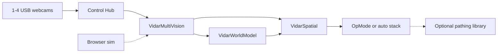

<h1 align="center">ViDAR</h1>

<p align="center">
  <strong>Robot-space situational awareness for FTC</strong><br />
  Vision-based tracking of game elements, friend/foe plates, and AprilTags.<br />
  Explicit coordinate frames, multi-camera fusion, and CPU-conscious pipelines on the Control Hub.
</p>

<p align="center">
  <a href="docs/SYSTEM_DESIGN.md"><strong>System design</strong></a> ·
  <a href="docs/API.md"><strong>API contract</strong></a> ·
  <a href="#browser-simulator"><strong>Browser simulator</strong></a> ·
  <a href="#quick-start"><strong>Quick start</strong></a> ·
  <a href="#using-vidar-in-your-code"><strong>Using ViDAR in your code</strong></a>
</p>

---

## What is ViDAR?

ViDAR turns USB webcam images into **positions in robot space**. It is not a pixel tracker: every observation carries an explicit frame, calibrated range, and (when fused) a short-term world-model track your OpMode can act on.

For **FIRST Tech Challenge** teams, that means game elements and alliance plates reported as robot-relative range and bearing, multi-camera handoff without guessing which camera saw what, and sparse AprilTag decode on a strict CPU budget. Vision is the sensor; **spatial understanding** is the product.

Use it on its own in TeleOp and custom OpModes, or wire it into your autonomous stack. **No pathing library required.** If you use [Pedro Pathing](https://pedropathing.com/), Road Runner, or a hand-written auto, ViDAR exposes observations and a world model your code can read directly.

ViDAR helps teams:

- **Know where things are in robot space:** calibrated range, bearing, and robot-frame positions from explicit coordinate frames and transform chains (not raw blob centroids).
- **See game pieces and plates reliably:** color-blob detection with geometric filtering, optional local Hough validation, and uncertainty-weighted range fusion (size, floor LUT, ground plane).
- **Tell friend from foe at runtime:** alliance from a REV Color Sensor on your robot sign and/or gamepad override at INIT.
- **Use AprilTags sparingly but reliably:** scout every frame; official FTC decode capped at **1 per second**; scout observations never alter absolute pose.
- **Scale to 1–4 cameras:** per-camera ROIs, mounts, and scheduling; fusion picks the best global element, plate, and tag each loop.
- **Tune before hardware:** browser simulator mirrors Java logic so students can iterate on ROIs, colors, and calibration overlays on a laptop.
- **Integrate your way:** read observations from any OpMode; Pedro Pathing and other autos are optional consumers, not dependencies.

**Competition path:** Java on the Control Hub. Python and Docker are for off-robot simulation, tests, and experiments only.

> **Disclaimer:** ViDAR is community-developed and unofficial. It is **not** affiliated with or endorsed by FIRST, REV Robotics, or other referenced vendors. Teams must verify legality and performance against the current-season FTC manual.

---

## Built by The Allsparks

ViDAR is created and maintained by **[The Allsparks](https://github.com/The-Allsparks)** (FTC Team **#36117**), a FIRST Tech Challenge team in Las Vegas, Nevada.

We built ViDAR for our own multi-camera robot: explicit coordinate frames, honest CPU budgeting, and a sim-first workflow so students can learn robot-space awareness without blocking drive practice. We publish it for other FTC teams who want the same foundations, and welcome issues, field validation reports, and pull requests.

Repository: **[The-Allsparks/ViDAR](https://github.com/The-Allsparks/ViDAR)**

---

## Current status

**Version 0.2.0**

| Area | Status |
|------|--------|
| Unified element + plate contour pipeline | Implemented; tested in simulation |
| Per-camera overlapping ROIs + alliance selector | Implemented; tested in simulation |
| Multi-camera fusion + world model | Implemented; **not hardware-validated at 4 cameras** |
| `VidarSpatial` facade (elements / allies / foes) | Implemented; motion tracking needs field validation |
| AprilTag scout + async decode | Implemented; tested in simulation |
| Browser simulator + Python parity tests | Available |
| Sustained 4× USB webcam on Control Hub | **Requires team validation.** See [docs/ROADMAP.md](docs/ROADMAP.md) |

Feature-level labels and maturity notes: [docs/SYSTEM_DESIGN.md](docs/SYSTEM_DESIGN.md).

---

## Explore

| Resource | Description |
|----------|-------------|
| [System design](docs/SYSTEM_DESIGN.md) | Architecture, pipelines, and feature status |
| [API contract](docs/API.md) | Cross-language names, units, and telemetry fields |
| [Configuration](docs/CONFIGURATION.md) | Season JSON, robot JSON, tuning reference |
| [Calibration](docs/CALIBRATION.md) | Floor LUT, ROI, and field calibration workflow |
| [Calibration checklist](docs/CALIBRATION_CHECKLIST.md) | One-page setup before first match |
| [Coordinate frames](docs/COORDINATE_FRAMES.md) | Frames, transforms, intrinsics, validation |
| [Teaching guide](docs/TEACHING.md) | Java lessons for Control Hub development |
| [Roadmap](docs/ROADMAP.md) | Multi-cam USB wiring, validation, optional pathing integration |
| [Browser simulator](#browser-simulator) | Tune ROIs and colors before deploying to the hub |
| [Robot templates](config/robots/README.md) | SVPRO vs C920 example `robot.json` files |
| [Pedro Pathing](https://pedropathing.com/) | Optional: one supported autonomous stack (not required) |

---

## Key capabilities

### Spatial model

Every detection is anchored in explicit frames (`ROBOT`, `CAMERA_OPTICAL`, `IMAGE`, and field when tags decode). Mount pose, intrinsics, and transform chains convert pixels into **robot-frame range, bearing, and position**. `VidarWorldModel` motion-corrects short-term tracks; `VidarSpatial` exposes **`elements()`**, **`allies()`**, and **`foes()`** in one facade.

See [docs/COORDINATE_FRAMES.md](docs/COORDINATE_FRAMES.md) for conventions and calibration.

### Detection

Default pipeline: **`VidarContourProcessor`**, one scaled ROI pass for season **elements** and **plates** (not full-frame Hough).

| Target | Approach |
|--------|----------|
| **Elements** | HSV mask → contour geometry → optional local Hough |
| **Plates** | Color mask → rotated rect → white-digit gate → width-based range |
| **AprilTags** | Scout every frame; official decode ≤ 1 s globally |

Per-camera ROIs default to **lower 65%** (elements), **middle 40%** (plates), and **upper 65%** (tags): overlapping bands, not a fixed 50/50 split.

### Ranging and fusion

Up to three slant-range estimates fused with uncertainty weighting:

- **Elements:** SIZE + FLOOR LUT + GROUND_PLANE
- **Plates:** plate width + FLOOR + ground @ z = 0

**ViDAR: Discover** telemetry shows `size=` / `floor=` / `ground=` on the element detail line.

### Multi-camera

Set `VidarConfig.CAMERA_COUNT` (1–4). Name webcams **`Webcam 1`** … **`Webcam 4`**. Each index uses `VidarCameraProfile.FOUR_SIDES` (0° / 90° / 180° / 270° bearings + mount offsets). Copy a template from [`config/robots/`](config/robots/README.md) and recalibrate floor LUT on-field.

### OpModes

| OpMode | Purpose |
|--------|---------|
| **ViDAR: Discover** | Live detection telemetry and tuning feedback |
| **ViDAR: Spatial** | Spatial telemetry only (no motor output) |
| **ViDAR: Spatial Map** | Full elements / allies / foes map preview |
| **ViDAR ROI Calibrate** | Per-camera ROI and horizon calibration |

---

## Browser simulator

Tune before hardware: mock scene or webcam, detection overlays, motion-track preview, calibration-axis preview. Same JSON tuning as on-robot Java.

```powershell
.\scripts\serve_sim.ps1
# or: python scripts/serve_sim.py
```

Open **http://127.0.0.1:8765** → **Start**.

Tuning file: `sim/vidar-tuning.json` ↔ `VidarConfig.java` / season JSON.

Run offline tests:

```powershell
pip install -r requirements-dev.txt
python -m pytest tests/ -v
```

---

## Quick start

### 1. Try the simulator (recommended)

```powershell
git clone https://github.com/The-Allsparks/ViDAR.git
cd ViDAR
pip install -r requirements-dev.txt
.\scripts\serve_sim.ps1
python -m pytest tests/ -v
```

### 2. Install on the Control Hub

1. Clone the [FTC SDK](https://github.com/FIRST-Tech-Challenge/FtcRobotController) and open it in Android Studio.
2. Copy `teamcode/org/firstinspires/ftc/teamcode/vidar/` → `TeamCode/src/main/java/.../vidar/`.
3. Copy a robot template from [`config/robots/`](config/robots/README.md) to `TeamCode/src/main/assets/vidar/robot.json`.
4. Configure USB webcams as **`Webcam 1`** … **`Webcam 4`** (see `VidarConfig.CAMERA_NAMES`).
5. Set `VidarConfig.CAMERA_COUNT` (1–4). Alliance is set at runtime — see below.
6. Run **ViDAR: Discover** → **ViDAR: Spatial** → **ViDAR: Spatial Map**.

ViDAR is a **spatial system only** — pose plus three groups (`elements()`, `allies()`, `foes()`). It never commands motors.

### Alliance (friend / foe)

No manual constant per match. Use `VidarAllianceSelector`:

| Method | When |
|--------|------|
| **Color sensor** on your robot sign (`alliance_color` in config) | Auto at INIT |
| **Gamepad Y** = RED, **B** = BLUE | INIT override |
| **Back** button | Toggle during match (optional) |

Mount the REV Color Sensor V3 on the **colored background** of your sign (not the white digits). Tune `ALLIANCE_COLOR_*` in `VidarConfig` if readings are ambiguous.

```java
VidarAllianceSelector alliance = new VidarAllianceSelector(hardwareMap);
while (!isStarted() && !isStopRequested()) {
    alliance.pollInit(gamepad1);
    telemetry.addData("Alliance", alliance.formatStatus());
    telemetry.update();
}
VidarSpatial spatial = VidarSpatial.create(hardwareMap, odom::getPose, alliance::get);
```

### Multi-camera wiring

The Control Hub has limited USB ports. For four cameras, use a **powered USB 2.0 hub** on **USB 3.0**, with hub power from **REV +5V aux** or an approved USB battery pack. Details: [docs/ROADMAP.md#phase-5--real-world-usb-wiring](docs/ROADMAP.md#phase-5--real-world-usb-wiring).

---

## Using ViDAR in your code

ViDAR **detects and remembers**. It does **not** own field pose or drive your robot. Your OpMode (or autonomous library) reads what ViDAR publishes:

| Output | Typical use |
|--------|-------------|
| `VidarSpatial.elements()` / `allies()` / `foes()` | Intake assist, foe avoidance, lane choice |
| `VidarWorldModel` tracks | Short-term memory through brief occlusion |
| AprilTag decode (≤ 1 s) | Sparse field fixes when **you** fuse them with odom / Pinpoint |

**Standalone:** **ViDAR: Spatial** and custom OpModes work with no pathing dependency.

**With autonomous pathing (optional):** wire odom at `VidarSpatial.create()`, optionally `setFieldPoseSupplier(follower::getPose)` for Pedro-primary pose, then read spatial groups in your drivetrain code. ViDAR does not bundle or require any pathing library.

```
vidar/
├── VidarConfig.java / VidarRuntimeConfig.java
├── config/                         ← season + robot JSON loaders
├── VidarCameraProfile.java / VidarCameraMount.java
├── VidarGeometry.java / VidarFrameRegions.java / VidarFramePipeline.java
├── VidarContourProcessor.java      ← unified element + plate detection
├── VidarAdaptiveTagProcessor.java / VidarTagScoutRunner.java / VidarTagDecodeWorker.java
├── VidarFrameMailbox.java          ← zero-copy frame handoff to worker thread
├── VidarVision.java                ← one camera
├── VidarMultiVision.java           ← 1–4 cameras fused
├── VidarWorldModel.java            ← short-term spatial memory
├── VidarSpatial.java               ← elements / allies / foes facade
├── VidarDiscoverOpMode.java
├── VidarTeleOp.java                ← ViDAR: Spatial
└── VidarAutoSeekOpMode.java        ← ViDAR: Spatial Map
```



Integration notes and validation checklist: [docs/ROADMAP.md](docs/ROADMAP.md).

---

## Documentation

| Document | Purpose |
|----------|---------|
| [docs/SYSTEM_DESIGN.md](docs/SYSTEM_DESIGN.md) | Architecture and feature status |
| [docs/API.md](docs/API.md) | Cross-language outer-layer contract |
| [docs/CONFIGURATION.md](docs/CONFIGURATION.md) | Tuning and JSON reference |
| [docs/CALIBRATION.md](docs/CALIBRATION.md) | Field calibration workflow |
| [docs/CALIBRATION_CHECKLIST.md](docs/CALIBRATION_CHECKLIST.md) | Printable calibration checklist |
| [docs/COORDINATE_FRAMES.md](docs/COORDINATE_FRAMES.md) | Frames, transforms, intrinsics |
| [docs/TEACHING.md](docs/TEACHING.md) | Java lessons for students |
| [docs/ROADMAP.md](docs/ROADMAP.md) | Phased plan and open work |
| [CONTRIBUTING.md](CONTRIBUTING.md) | Development setup and guidelines |

---

## Optional: Python / Docker

Off-robot experiments only:

```powershell
docker compose up --build
```

The competition path remains **Java + browser sim**.

---

## Acknowledgements

ViDAR’s coordinate-frame and calibration architecture was **substantially informed** by [**Matt Vitelli**](https://github.com/MattVitelli)’s presentation [*How Robots Understand Space*](https://vivalosmentors.org/wp-content/uploads/2026/08/How_Robots_Understand_Space-Vitelli.pdf) ([Viva Los Mentors](https://vivalosmentors.org/details/)). That work motivated explicit frames, destination-from-source transform chains, practical intrinsic/extrinsic calibration, visualization-first validation, and offline pose refinement, adapted here for FTC vision on the Control Hub.

Full attribution and frame conventions: [docs/COORDINATE_FRAMES.md](docs/COORDINATE_FRAMES.md).

**Conceptual credit only.** [Matt Vitelli](https://github.com/MattVitelli) did not author ViDAR code, endorse ViDAR, or license code to this project.

---

## License

MIT. See [LICENSE](LICENSE).
