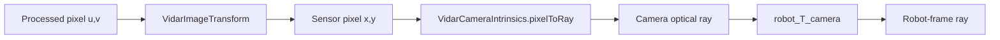

# Coordinate Frames, Transforms, and Calibration

**Status:** **Implemented**, **Tested in simulation** (Python parity tests + browser calibration-axis overlay). On-robot Java compiles in FTC SDK; **not Hardware validated**.

ViDAR models vision data in explicit coordinate frames so teams can trust robot-relative ranging, multi-camera fusion, and AprilTag localization without silent axis or unit mistakes.

---

## Why coordinate frames matter

A pixel in a camera image is not a robot position. To use vision reliably you need to know:

- Which **frame** each number belongs to (field, robot, camera optical, image pixels).
- Which **direction** a transform applies (`destination_T_source`).
- Whether a result is a **point**, a **direction/ray**, or a **bearing only**.
- When the observation was **captured** versus when your code **processed** it.

Matt Vitelli’s presentation [*How Robots Understand Space*](https://vivalosmentors.org/wp-content/uploads/2026/08/How_Robots_Understand_Space-Vitelli.pdf) (Viva Los Mentors) motivated this architecture: explicit frames, transform chains, intrinsic/extrinsic calibration, visualization-first validation, and offline pose refinement — without implying endorsement of ViDAR or authorship of this codebase.

---

## Acknowledgements and sources

ViDAR’s explicit coordinate-frame, transform, and calibration architecture was **substantially informed** by Matt Vitelli’s *How Robots Understand Space* presentation at Viva Los Mentors. The presentation provided the vital conceptual foundation for the destination-from-source transform convention, camera–robot–field transform chains, practical intrinsic and extrinsic calibration guidance, visualization-first validation, and the proposed offline pose-refinement workflow.

| | |
|---|---|
| **Speaker** | Matt Vitelli |
| **Talk** | How Robots Understand Space |
| **Event** | [Viva Los Mentors](https://vivalosmentors.org/details/) |
| **Presentation** | [PDF](https://vivalosmentors.org/wp-content/uploads/2026/08/How_Robots_Understand_Space-Vitelli.pdf) |
| **Accessed** | 2026-08-05 |

**Public background stated in the presentation:** FRC alumnus (Ames Amperes #3243, 2010–2011); BS and MS from Stanford (AI and robotics focus); previously led trajectory planning at Lyft Level 5; Principal Engineer leading calibration, localization, and mapping for DoorDash Dot.

Concepts here are paraphrased for ViDAR’s FTC context. Matt Vitelli did not author ViDAR code, endorse ViDAR, or license code to this project.

---

## Frame conventions

### Field (`FIELD`)

FTC / SDK convention: origin at field center, **+X right**, **+Y forward**, **+Z up** (inches). AprilTag positions in season JSON use this frame.

### Robot (`ROBOT`)

ViDAR robot frame: **+X forward**, **+Y left**, **+Z up** from the floor. Distances use the active `distanceUnit` (default inches). Positive **yaw** is counterclockwise viewed from above.

### Camera optical (`CAMERA_OPTICAL`)

OpenCV-style optical frame: **+X image-right**, **+Y image-down**, **+Z optical-forward** (into the scene).

Do not treat camera axes as robot axes. Mount extrinsics (`robot_T_cameraOptical`) bridge optical rays to the robot.

### Image pixels

- **Full-frame** pixels: `cx`, `cy` on the 640×480 (or configured) capture.
- **Process-frame** pixels: after ROI crop and downscale (floor LUT, horizon row).

Use `VidarImageTransform` (Java) / `ImageTransform` (Python) to map processed → calibrated sensor pixels before `pixelToRay()`.

---

## Transform notation: `destination_T_source`

A transform named `robot_T_camera` maps a point **from camera frame into robot frame**:

```
p_robot = robot_T_camera * p_camera
```

Examples:

| Name | Meaning |
|------|---------|
| `robot_T_camera` | Camera origin/pose relative to robot |
| `camera_T_robot` | Inverse — derived, not duplicated in JSON |
| `field_T_robot` | Robot pose on field (AprilTag decode, odometry) |

**Points** use rotation **and** translation. **Directions/rays** use rotation **only**.

**Composition:** `(A_T_C) = (A_T_B) * (B_T_C)`.

**Inversion:** `(B_T_A) = inv(A_T_B)`.

Implementation: `teamcode/.../vidar/geometry/VidarTransform3D.java` (Python: `src/vidar/transforms.py`).

### Rotation order (documented and tested)

Mount rotation uses **intrinsic** roll-pitch-yaw with multiply order:

```
R = Rz(yaw) * Rx(pitch) * Rz(roll)
```

Camera pipeline applies `Rz(bearing + mountYaw) * Rx(mountPitch) * Rz(mountRoll)` after a fixed optical-to-robot-base mapping. This matches legacy `VidarGeometry.rayDirectionRobotFrame()`.

---

## Static transform registry

`VidarTransformRegistry` builds cached `robot_T_cameraOptical` and `cameraOptical_T_robot` from each `VidarCameraProfile` at init (1–4 cameras). Missing or non-finite mounts surface in validation warnings.

Teams configure extrinsics once in robot JSON (`mount.x/y/z`, `bearingDeg`, `pitchDeg`, `rollDeg`, `yawDeg`) — not a competing config system.

---

## Camera intrinsics

`VidarCameraIntrinsics` wraps:

- `fx`, `fy`, `cx`, `cy`
- calibration `imageWidth`, `imageHeight`
- optional `distortionModel` / `distortionCoeffs`
- `pixelToRay()`, `pointToPixel()`

**Operational model:** zero-distortion pinhole on the Control Hub. Brown-Conrady coefficients may be stored for offline tools; fisheye is rejected on-robot. Do not assume 640×480 intrinsics apply to cropped/processed images without `VidarImageTransform`.

Legacy fields `focalLengthPx`, `principalPointX/Y` remain authoritative in robot JSON.

---

## Crop and resize



---

## Spatial observations

| Kind | Frame | Depth |
|------|-------|-------|
| Image detection | pixels | n/a |
| Element/plate fix | `ROBOT` | inferred (size / floor LUT / ground plane) |
| Tag scout | bearing | `BEARING_ONLY` — never localizes |
| Tag decode | `FIELD` | measured (SDK pose) |

Helpers: `VidarObservationSpatial`, `VidarSpatialDepthKind`. Observations carry `captureTimeNanos` (callback/receipt time — not exposure start unless the platform provides it).

Timestamped pose lookup: `VidarPoseLookup` + existing `VidarOdomHistory` (bounded ring buffer, interpolation when bracketed).

---

## AprilTag localization chain

Decoded tags provide **`field_T_robot`** from the FTC SDK at capture time. Documented equivalent:

```
field_T_robot = field_T_cameraOptical * cameraOptical_T_robot
```

ViDAR uses the SDK pose directly in `VidarTagObservation.fieldPoseAtCapture`. `VidarAprilTagTransforms` documents and tests chain consistency. **Scout observations never alter absolute pose** (`VidarLocalizationFusion.wouldScoutAlterPose()` → false).

---

## Ground-plane intersection

For floor-contact targets, `VidarGroundPlane` intersects a camera ray with **z = 0** in robot frame. Rejects parallel rays and rays pointing away from the floor. `VidarGeometry.floorPointInRobot()` uses `robot_T_camera` on the primary path; floor LUT remains a fusion fallback.

---

## Validation tooling

- **Browser sim:** enable **Calibration axes (robot / camera)** — axis triad overlay (X red, Y green, Z blue), forward ray, sample pixel markers.
- **Hardware:** `VidarRoiCalibrationOpMode` for ROI/horizon (existing).
- **Diagnostics:** `VidarCalibrationDiagnostics` — calibration profile, resolution, transform notation, observation age, lookup failures (low-rate telemetry).

---

## Robot JSON calibration fields

Under `cameraDefaults` or per-camera `camera`:

```json
"calibrationWidth": 640,
"calibrationHeight": 480,
"calibrationVersion": "example-v1",
"calibrationDate": "2026-08-05",
"distortionModel": "none",
"focalLengthPx": 340,
"principalPointX": 320,
"principalPointY": 240
```

Mount block defines `robot_T_camera` translation and orientation (degrees).

---

## Offline calibration dataset (**Planned** optimizer)

JSONL records for future extrinsic refinement — see `config/calibration/sample-record.jsonl` and `VidarCalibrationDataset`.

**Workflow (planned):**

1. Record Dataset — diverse motion, accurate timestamps, multiple markers  
2. Extract Scans  
3. Optimize Poses — Ceres or similar nonlinear least squares (**offline only**)  
4. Validate — reprojection error, cross-camera agreement  
5. Export Calibration — update robot JSON  

The on-robot nonlinear optimizer is **not implemented** in this PR.

---

## Debugging checklist

| Symptom | Check |
|---------|--------|
| Left/right swapped | `bearingDeg` sign, `+Y` left convention |
| Forward/back wrong | transform direction (`robot_T_camera` vs `camera_T_robot`) |
| Range scale wrong | crop ignored — map processed pixels first |
| Tag pose jump | scout vs decode; pose gates; observation age |
| Degrees vs radians | JSON and telemetry use **degrees** |

---

## Limitations

- No runtime fisheye or full Brown-Conrady correction on Control Hub (**Planned** offline).  
- FTC camera timestamps are receipt/callback time — document honestly.  
- Multi-camera hardware validation **not** claimed.  
- Four-camera USB stress **not Hardware validated**.

See also: [CONFIGURATION.md](CONFIGURATION.md), [CALIBRATION.md](CALIBRATION.md), [API.md](API.md).
