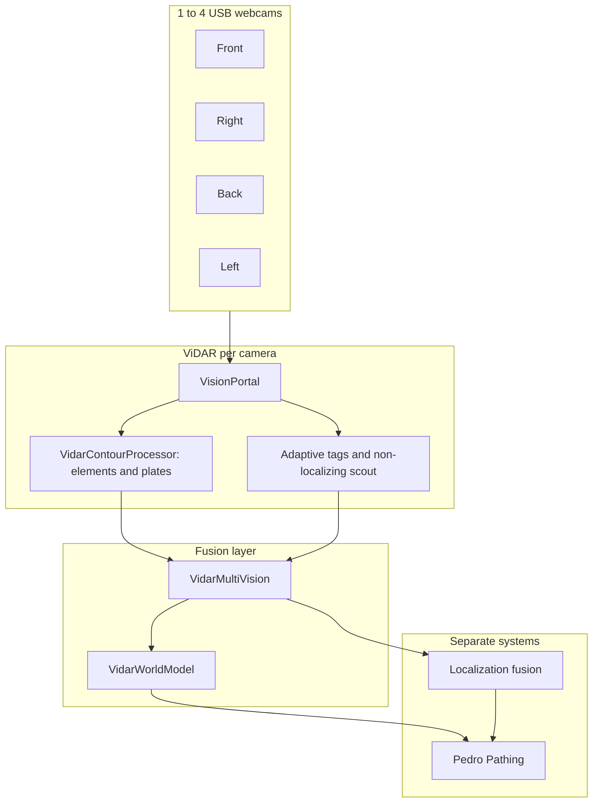

# ViDAR Roadmap

Phased plan for multi-camera deployment, robot-space situational awareness, optional pathing integration, and field validation.

## Architecture (current)



ViDAR **detects and remembers** in robot space; it does **not** own field pose. A separate localization module should fuse Pinpoint/odom/IMU with sparse ViDAR tag fixes, then feed your autonomous stack (Pedro, Road Runner, or custom). Pathing libraries are optional consumers, not requirements.

---

## Phase 1 — Multi-camera (1–4) ✅ in code

| Task | Status |
|------|--------|
| `VidarConfig.CAMERA_COUNT` (1–4) | Done |
| `VidarCameraProfile` mount bearing + `mountX`/`mountY` | Done |
| `VidarMultiVision` global element/plate/tag pick | Done |
| Per-camera calibration OpMode | Done (`VidarRoiCalibrationOpMode`) |
| Sim multi-cam preview | Backlog (deferred — not blocking) |

**Robot configuration:** name webcams `Webcam 1` … `Webcam 4` to match `VidarConfig.CAMERA_NAMES`. Set `CAMERA_COUNT` to the number physically installed.

**Mount calibration checklist:**

1. Measure lens position from robot center → `mountX`, `mountY` in `VidarCameraProfile.FOUR_SIDES`.
2. Confirm per-camera ROIs and horizon (`VidarCameraRoiConfig` — defaults: element lower 65%, tag upper 65%; use `VidarRoiCalibrationOpMode`).
3. Per camera: element at 12/24/36/48″ → update `floorCyPx` / `floorDist` and `focalLengthPx`.
4. Alliance at runtime via `VidarAllianceSelector` (color sensor on own sign and/or gamepad Y/B at INIT).

---

## Architectural improvements (2026-07 audit)

| Item | Status |
|------|--------|
| Unified contour element detection | **Done** |
| Per-camera overlapping ROIs | **Done** |
| Scout-only localization removed | **Done** |
| Motion-correct world model | **Done** |
| Uncertainty-weighted range fusion | **Done** |
| Camera scheduler (disable processors before stream stop) | **Done** |
| Full checkerboard intrinsic calibration OpMode | **Closed — not planned** |
| Runtime auto-switch element detector under CPU load | **Closed — not planned** (metrics only) |
| Profile-aware tag scout ROI in `VidarTagScoutRunner` | **Done** |
| Browser sim: `elementId`, motion tracks, offensive lane | **Done** — see [sim/README-SIM.md](../sim/README-SIM.md) |
| Offensive lane helper on `VidarSpatial` | **Done** (`VidarOffensiveLaneAnalysis`) |
| Four-camera USB stress validation | **Open — requires hardware** |
| `java-pure/` JVM test harness | **Done** |
| `VidarSpatialSnapshot` (stable per-loop queries) | **Done** |
| `VidarSession` + instance tag decode worker | **Done** |
| `MultiCameraFusion` extraction | **Done** |
| `VidarSettings` + JSON tuning path | **Done** (constants remain as fallbacks) |
| `ElementDetector` / `PlateDetector` split | **Done** |
| Deprecate `spatial.vision()` | **Done** — use `diagnostics()` + `lastFrame()` |
| Remove `.refactor-staging/` duplicate tree | **Done** |

---

## Phase 2 — Plate detection upgrade ✅ done (2026-07)

Pipeline: **HSV mask → contour → `minAreaRect` → white-digit ratio → width-based primary range + floor cross-check → robot frame**.

| Improvement | Status |
|-------------|--------|
| Tune HSV + aspect for your plate dimensions | Field tune (ongoing) |
| Known plate width for size-based range cross-check | **Done** |
| Temporal filter (require 2 frames before world model) | **Done** (`VidarTemporalFilter`) |
| Digit template / OCR gate (reject solid red tape) | **Closed — not planned** (white-digit ratio sufficient for now) |

---

## Phase 3 — World model & assisted behaviors ✅ foundation

`VidarWorldModel` keeps short-term tracks (elements, allies, foes) with TTL merge.

| Behavior | Uses |
|----------|------|
| Auto element collection | `elements()`, ranked live + `VidarSpatialTrack` memory (odom required) |
| Defensive avoidance | `foes()`, `intakeBlocked()` |
| Ally awareness | `allies()` |
| Motion tracking | Predict → gate → associate (`VidarTrackAssociator`); field velocity on tracks |

**Next:** consume `spatial.elements()` / `allies()` / `foes()` in Pedro callbacks — team maps bearing/distance to motion.

---

## Phase 4 — Localization (separate system) + Pedro

ViDAR outputs:

- `VidarTagObservation` + `getBackdatedFieldPose(odomNow)` — sparse absolute fixes
- `VidarWorldModel` — robot-relative obstacles and game elements

Suggested split:

```
teamcode/.../localization/
  RobotPoseFusion.java    // odom + IMU + optional Pinpoint
  TagCorrection.java      // consumes ViDAR tag fixes
  FieldPoseProvider.java  // single Pose2D for Pedro
```

Pedro consumes `FieldPoseProvider.get()` for path following; assisted modes read `VidarWorldModel` for reactive overrides (slow near foe, abort intake if blocked).

**Do not** run full AprilTag decode inside Pedro’s control loop — keep ViDAR’s 2 s gate.

---

## Phase 5 — Real-world USB wiring

### Rules (BIOBUZZ Competition Manual V0, Jul 2026)

Re-check [Section 12](https://ftc-resources.firstinspires.org/ftc/game/manual) and Team Updates after kickoff (Sep 12, 2026). Game rules and expansion limits are not in the V0 preview.

- **R602:** COTS USB battery packs ≤ 100 Wh allowed for peripherals (with constraints).
- **R611:** Powered USB hubs may draw from:
  - Approved COTS USB battery pack, **or**
  - REV Control Hub / Expansion Hub **+5V auxiliary port** (5 V, 2 A max per port).
- **R707 / R708:** USB vision only; UVC webcams natively supported by the Robot Controller app (single sensor; UVC stream only). No stereoscopic cameras.
- **R704:** During **MATCH play**, FTC Dashboard and similar third-party streaming tools are prohibited. Use Driver Station telemetry only; disconnect laptops from RC Wi-Fi.
- Vision must run on the Control Hub via the Robot Controller app (R708); no off-board coprocessor for the competition path. Custom TeamCode (ViDAR) is allowed (R304).

### Control Hub ports

| Port | Use for ViDAR |
|------|----------------|
| **USB 3.0 Type-A** | Primary — plug hub or first camera here (prefer over USB 2.0; ESD/Wi‑Fi stability) |
| **USB 2.0 Type-A** | Second camera only if needed |
| **USB-C** | Optional third camera (legal UVC) |
| **+5V aux** | Power for **powered** hub only — not data |

The Control Hub has **two Type-A data ports + USB-C**. For **3–4 cameras**, use a **powered USB 2.0 hub**.

### Recommended hub (FTC-docs tested historically)

**Anker 4-port USB 2.0 powered hub** (often cited in [FTC UVC camera docs](https://ftc-docs.firstinspires.org/en/latest/hardware_and_software_configuration/configuring/configuring_uvc_camera/configuring-uvc-camera.html)).

Power options:

1. **REV +5V aux → custom cable → hub power input** (cleanest on-robot; requires crimped 0.1″ to USB-B/Micro power).
2. **Approved USB battery pack → hub power port** (easier bench setup; strap pack to robot per R602).

### Example 4-camera wiring

```
                    ┌─────────────────┐
  Webcam 1 ────────►│                 │
  Webcam 2 ────────►│  Powered USB    ├──► Control Hub USB 3.0
  Webcam 3 ────────►│  2.0 Hub (4pt)  │
  Webcam 4 ────────►│                 │
                    └────────┬────────┘
                             │ power
                    ┌────────▼────────┐
                    │ REV +5V aux OR  │
                    │ legal USB pack  │
                    └─────────────────┘
```

### Practical limits

- Use **640×480** portal when tags enabled (`VidarTagConfig`).
- Identical camera models simplify intrinsics sharing (team: SVPRO 8MP module).
- Short USB cables, strain relief, ferrite if you see dropouts.
- Log `portal.getCameraState()` and frame timing in a stress OpMode before competition.

### Cameras

- **Team hardware:** [SVPRO 8MP USB module](https://www.amazon.com/dp/B0DCF8WW6V) — 105° HFOV, fixed focus, IMX179, UVC USB 2.0. Wide rectilinear lens (not fisheye); see [CALIBRATION.md](CALIBRATION.md).
- Logitech C920 / C270 class UVC webcams remain common FTC references; intrinsics differ (~70–80° HFOV).
- Use **identical camera models** across all four mounts so `cameraDefaults` intrinsics can be shared.
- Mount all cameras with **horizon near 50%** row for the dual ROI layout.

---

## Phase 6 — Field validation roadmap (#5)

Structured test plan before trusting ViDAR in auto.

### 0 — Bench metrics (no robot)

| Metric | Target | How |
|--------|--------|-----|
| Element FPS per camera | ≥ 15 | Discover telemetry (bench/practice); FTC Dashboard OK off-match only (R704) |
| Tag decode latency | < 400 ms | Log time around decode |
| Tag decode CPU spike | acceptable at 2 s interval | Discover telemetry or Dashboard off-match |
| Plate false positives | < 1/min on empty field | 5 min static scene |

### 1 — Single-camera calibration

- [ ] `DEFAULT_ELEMENT_DIAMETER` measured
- [ ] Floor LUT within ±3″ at 12/24/36/48″
- [ ] `focalLengthPx` within ±10% of tape measure
- [ ] Plate detects real alliance panel, rejects red tape on floor

### 2 — Multi-camera USB stress

- [ ] 2 cams: 10 min no disconnect
- [ ] 4 cams: 10 min no disconnect
- [ ] Wi‑Fi DS link stable during vision (USB 3.0 preferred)
- [ ] Record worst-case loop time in OpMode

### 3 — Match lighting

- [ ] Venue lighting: elements + plates at 24″ and 48″
- [ ] Glare: perforated elements still detected
- [ ] Motion blur: slow drive-by detection rate

### 4 — Integration

- [ ] `VidarWorldModel` foe memory survives 1 s occlusion
- [ ] **ViDAR: Spatial Map** — `trackId` stable through 0.5 s occlusion; `elementId#0` nearest per type
- [ ] Tag fix + odom backdating vs known field dimension

### 5 — Pedro auto routines

- [ ] Localization module provides stable `Pose2D` at 20 Hz
- [ ] ViDAR tag correction every 2+ s does not jerk path
- [ ] Assisted intake uses `nearestElement()` without fighting Pedro turn

### Deliverable

Maintain a team **validation log** (spreadsheet or `docs/validation-log.md`): date, hub firmware, camera count, pass/fail per row above.

---

## Coordinate frames and offline calibration

| Task | Status |
|------|--------|
| Explicit `robot_T_camera`, intrinsics, crop mapping | ✅ **Implemented**, **Tested in simulation** |
| Browser calibration axis overlay | ✅ **Tested in simulation** |
| JSONL offline calibration dataset schema | ✅ **Implemented** |
| Nonlinear extrinsic optimizer (Ceres / offline) | **Planned** |
| Optional Brown-Conrady runtime (mild radial at image edges) | **Planned** — low priority; pinhole is the default for FTC USB cameras |
| One-camera / multi-camera hardware validation | **Planned** |

Fisheye lenses are **not** a ViDAR target. Team cameras (SVPRO 105° wide rectilinear) and typical Logitech-class USB modules use pinhole or mild radial distortion — not fisheye projection.

Workflow (planned): Record Dataset → Extract Scans → Optimize Poses → Validate → Export. See [COORDINATE_FRAMES.md](COORDINATE_FRAMES.md).

---

## TensorFlow for ViDAR?

**Verdict: not worth it for the core ViDAR stack right now.**

| Factor | Assessment |
|--------|------------|
| Known geometry | Balls (circle + diameter) and plates (rectangle + white digits) are solved cheaper with OpenCV |
| CPU budget | 4× cameras + TFOD full-frame inference will fight the Control Hub |
| Training burden | FTC-ML helps, but data collection + false positives add season risk |
| Teaching value | Geometry pipelines are debuggable on Driver Station; TF is a black box |
| When TF *might* help | Unstructured game pieces, heavy occlusion, or no reliable color/geometry |

If experimenting: run TFOD on **one** camera at low resolution, **not** alongside 4 portals + AprilTag. Keep it off the competition critical path until bench proves headroom.

---

## File map (Java)

| File | Role |
|------|------|
| `VidarMultiVision` | 1–4 camera fusion |
| `VidarCameraProfile` | Mount bearing + offsets + LUT |
| `VidarContourProcessor` | Season elements + friend/foe plates |
| `VidarWorldModel` | Short-term spatial memory |
| `VidarAdaptiveTagProcessor` | Scout + crop decode tags |
| `VidarGeometry` | Range fusion + robot frame |
