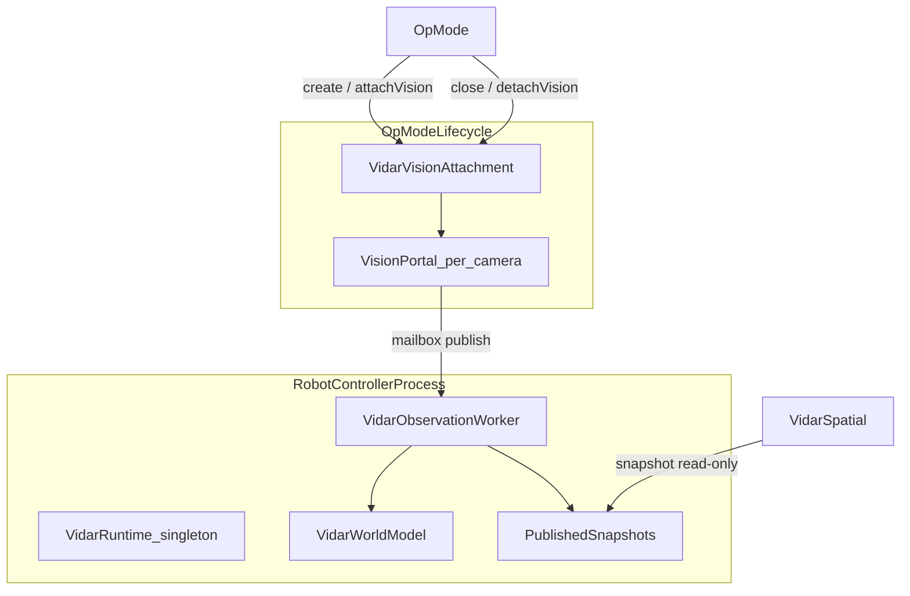

# ViDAR System Design

ViDAR turns USB webcam detections into **calibrated positions in robot space**. Vision pipelines (color blobs, plate geometry, sparse AprilTags) feed explicit coordinate frames, range fusion, multi-camera fusion, and a short-term world model. Your OpMode reads robot-frame observations and tracks; field pose and autonomous pathing stay separate and optional.

Status labels used throughout ViDAR documentation:

| Label | Meaning |
|-------|---------|
| **Implemented** | Code exists in `teamcode/.../vidar/` |
| **Tested in simulation** | Covered by browser sim or Python tests |
| **Tested on one camera** | Manual OpMode validation on a single webcam |
| **Tested on multiple cameras** | Not yet validated at scale |
| **Hardware validated** | Sustained Control Hub USB + CPU stress test passed |
| **Planned** | Documented but not implemented |

## Architecture

ViDAR separates **long-lived perception** from **ephemeral FTC camera resources**:



| Owner | Resources |
|-------|-----------|
| **`VidarRuntime`** (process singleton) | world model, fusion engine, tag decode worker, observation worker, snapshot publication, field pose context |
| **`VidarVisionAttachment`** (per attach) | VisionPortal, FTC processors, mailboxes, global vision worker |

**Threading:**

| Thread | Role |
|--------|------|
| VisionPortal callback | Publish frame to mailbox only |
| `VidarGlobalVisionWorker` | Round-robin async contour/tag scout processing |
| `VidarTagDecodeWorker` | Async AprilTag crop decode (≤ 1/s) |
| `VidarObservationWorker` | Poll cameras, fuse, update world model, publish snapshots. Tick failures are recorded (last error, consecutive/total counts) and visible in `VidarDiagnostics`; the worker stays alive. |
| Robot / OpMode loop | Read immutable `snapshot()` — never advances perception |

**FTC lifecycle (Auto → TeleOp):**

```
RC start → VidarRuntime.getOrCreate()
Auto INIT → attachVision() via VidarSpatial.create()
Auto STOP → detachVision() via spatial.close()
TeleOp INIT → applyBootstrap (rebind odom/alliance) + attachVision (runtime reused)
TeleOp STOP → detachVision()
RC exit → VidarRuntime.shutdown() (optional)
```

Each `VidarSpatial.create(...)` rebinds odom and alliance suppliers onto the live process runtime before re-attaching cameras, so Auto and TeleOp may pass different suppliers.

## Element detection — **Implemented**, **Tested in simulation**

Unified pipeline: `vidar.detect.VidarContourProcessor` (season `elements[]` + `plates[]` in one scaled ROI pass).

1. Crop to per-camera element ROI (default: lower 65% of frame)
2. HSV threshold per configured element or plate
3. Configurable morphology (open/close/erode/dilate)
4. Circle elements: contour filter → `minEnclosingCircle` → interior validation → optional local Hough
5. Plate elements: `minAreaRect` → white-digit ratio gate → width-based range

Detector mode per element: `COLOR_BLOB` or `COLOR_BLOB_WITH_LOCAL_HOUGH` (see season JSON / `VidarElementSpec`).

## Regions of interest — **Implemented**, **Tested in simulation**

Per-camera via `VidarCameraProfile.roiConfig` (`VidarCameraRoiConfig`):

| ROI | Default | Overlaps |
|-----|---------|----------|
| Element | Lower 65% | Yes |
| Plate | Middle 40% starting at 30% | Yes |
| AprilTag | Upper 65% | Yes |

Horizon is per-camera (`horizonRowPx` in process coordinates). ROI calibration OpMode: `VidarRoiCalibrationOpMode`.

## Camera scheduling — **Implemented**, not **Hardware validated**

States (`VidarCameraScheduler.State`):

| State | Streaming | Processors |
|-------|-----------|------------|
| PRIMARY | On | Element + plate + tag schedule |
| SECONDARY | On | Lightweight element only |
| IDLE | On | All disabled |
| DEEP_IDLE | Off after 2.5 s debounced | All disabled |

Cameras normally remain streaming while processors are disabled. Stream stop is delayed and debounced.

Health tracking: `VidarMetrics.CameraHealth` (CONFIGURED → CONNECTED → STREAMING → PROCESSING → HEALTHY / FAILED).

## AprilTag — **Implemented**, **Tested in simulation**

- Official FTC `AprilTagProcessor` via `VidarTagCropDecoder`
- Scout (`VidarTagScoutRunner`) identifies probable tag regions on a dedicated worker thread
- Scout observations (`VidarTagScoutObservation`) **never alter absolute pose**
- Async crop decode via `VidarTagDecodeWorker` + `VidarFrameMailbox` buffer swap
- Decode budget: `TagDecodeBudget` (1 decode / second global, per runtime)
- Pose gates in `VidarLocalizationFusion`

## Plate ranging — **Implemented**, **Tested in simulation**

Primary: `distance = plateWidth × focalLengthPx / observedPixelWidth`

Floor LUT used only as secondary consistency check when geometry supports it.

## Range fusion — **Implemented**, **Tested in simulation**

`VidarRangeResult` with geometry-authoritative fusion (elements = SIZE + FLOOR + GROUND_PLANE; plates = width + floor + ground @ z=0). Valid ground-plane range wins the distance; heuristics cross-check confidence or fill in when geometry is rejected.

Component estimates exposed as `source0`, `source1`, and `sourceCount` (up to 3) for telemetry. **ViDAR: Discover** logs `size` / `floor` / `ground` on the element detail line.

## World model — **Implemented**, **Tested in simulation**

`VidarWorldModel` motion-corrects tracks using odom delta (translation + rotation) or field-pose reprojection when available. Owned by `VidarRuntime` and persists across camera detach.

Association and TTL clock off **observation capture time**, not the ~1 ms observation-worker tick. Repeating the same fused detections (same `captureTimeNanos`) is a miss/coast: `lastSeenNanos` is not refreshed from stale blobs. `update(null, now)` also coasts so `detachVision()` ages tracks. After `WORLD_*_TTL_SEC` with no new frame, tracks are pruned and `intakeBlocked()` goes false. Tracks expose `lastSeenNanos` and `missCount` — treat high miss count or age as stale. Set `WORLD_ASSOCIATE_ON_NEW_FRAME_ONLY` false to restore last-blob re-association every tick.

## Spatial facade — **Implemented**, **Tested in simulation**

`VidarSpatial` is the Pedro-style entry point. Perception advances in the background; read `snapshot()` each loop.

| Output | Role |
|--------|------|
| `snapshot()` | Immutable elements / allies / foes / pose for this moment |
| `fieldPose()` / `robotPose()` | Pose estimates (tag fusion + optional odom supplier) |
| `elements()` | Pinned spatial groups (legacy — prefer `snapshot()`) |
| `allies()` | Friendly alliance plates |
| `foes()` | Opponent plates |
| `intakeBlocked()` | Spatial hint — foe in intake cone |

Motion-corrected tracks run only when `isMotionTrackingActive()` (odom supplier + `WORLD_MOTION_TRACKING_ENABLED`). Without odom, queries return live detections only.

**Track associator:** each cycle predicts field position (`pos + velocity × dt`), reprojects to robot frame, gates detections within `WORLD_TRACK_GATE_RADIUS_IN`, updates velocity with EMA, coasts on miss. Elements classify as `STATIC` after stable low velocity; foes/allies as `MOVING` when speed exceeds threshold.

## Multi-camera — **Implemented**, not **Hardware validated**

Architecturally supports 1–4 cameras via `VidarVisionAttachment`. Four simultaneous cameras require USB hub validation on the actual Control Hub — configuration success does not guarantee USB stability.

## Resource budgeting — **Implemented**

`VidarResourceBudget` degrades tag frequency, plates, and secondary cameras based on measured loop CPU.

## JVM unit tests — **Implemented**

Pure-logic tests run locally via `cd java-pure && ./gradlew test` (TagDecodeBudget, MultiCameraFusion, VidarTemporalFilter, config, range fusion). CI runs these on Ubuntu.

## Simulator parity — **Tested in simulation**

Browser sim (`sim/`) mirrors Java logic for ROIs, color-blob detection, weighted range fusion, and non-localizing scout observations. Cross-language field names and method contracts are defined in [API.md](API.md). Intentional differences documented in `sim/README-SIM.md`.

## Competition legality

Teams must verify final implementation against the current-season FTC manual. ViDAR does not claim competition readiness without team validation.

Reviewed against **BIOBUZZ Competition Manual V0** (Jul 2026). Nothing in V0 appears to prohibit ViDAR's architecture (UVC webcams + custom Java on the Control Hub). Re-check after kickoff when game rules and expansion limits (R105) are published.

| Topic | BIOBUZZ V0 rule | ViDAR note |
|-------|-----------------|------------|
| On-robot vision | R708 | UVC webcams via Robot Controller app; each camera must be natively supported (validate SVPRO or other models on your hub) |
| USB wiring | R707, R611, R602 | Hub + cameras on USB; hub power from +5V aux or legal USB pack |
| Custom software | R304 | ViDAR TeamCode is allowed |
| Match networking | R704 | No FTC Dashboard or continuous streaming during MATCH play; Driver Station telemetry only |
| Fair play | R202 | Do not put 36h11 AprilTag-like graphics on the robot |
| Expansion / game rules | R105, Section 11 | **TBD at kickoff** (Sep 12, 2026) |

Off-robot tools (browser sim, Python tests, Docker) are for development only and must not run vision during matches.

Manual: [ftc-resources.firstinspires.org/ftc/game/manual](https://ftc-resources.firstinspires.org/ftc/game/manual)
